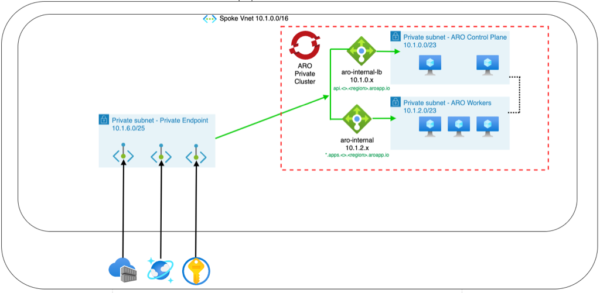
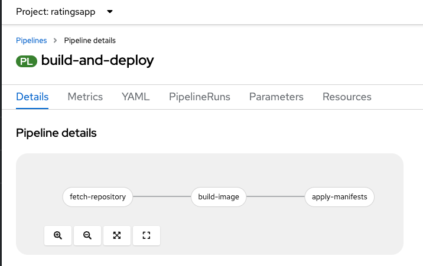
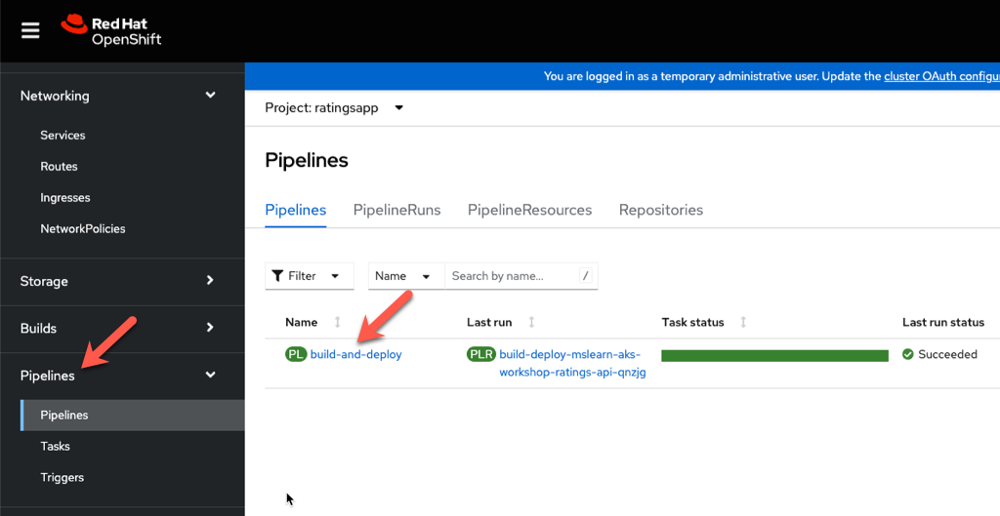
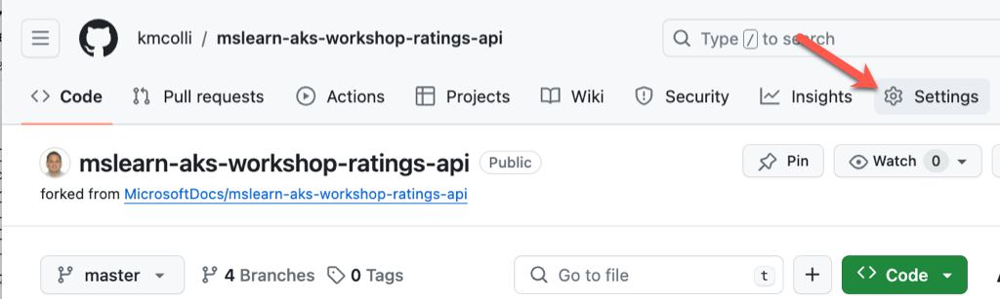
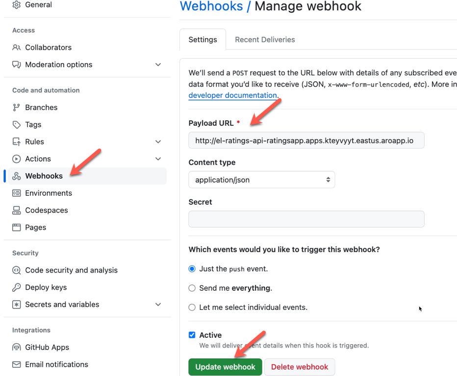
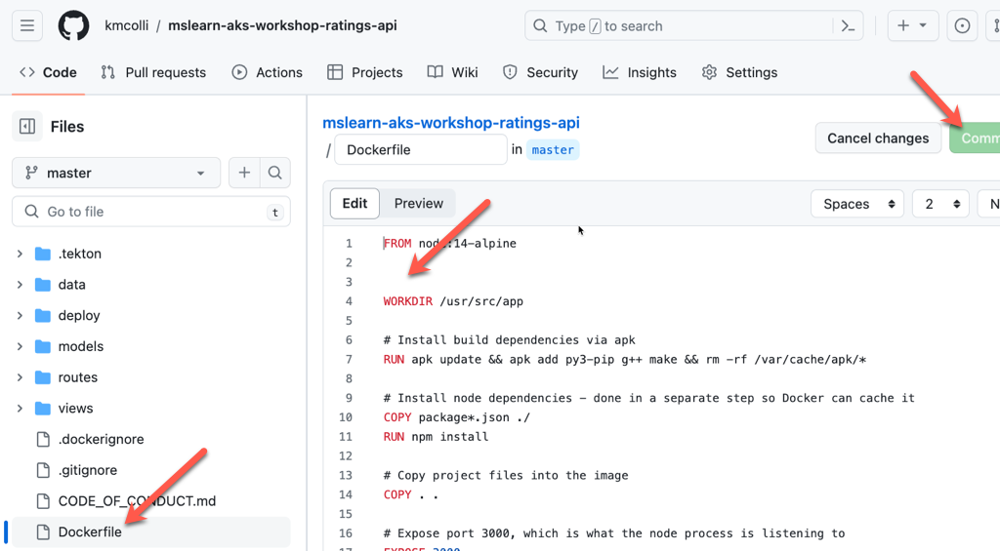
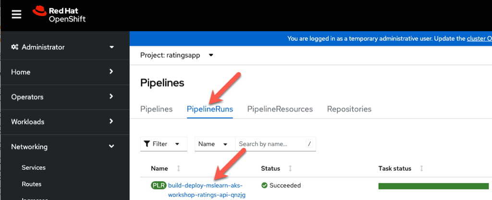

# Deploying an enterprise application to ARO

This guide will show you how to deploy an enterprise application to ARO using the following Azure services: Key Vault, Azure Container Registry, and Cosmos DB.  Following best practices, the above services will be integrated with an ARO cluster using private endpoints.



This guide is adopted from the ARO reference architecture and focuses specifically on deploying an application end to end.
https://techcommunity.microsoft.com/t5/fasttrack-for-azure/azure-red-hat-openshift-reference-architecture-amp-reference/ba-p/3470115

## Prerequistites:
refer to the [prereq doc](prereq.md) to setup everything from scratch

A VNET with 3 subnets:
one for the ARO Workers
one for the ARO Control Plane
one for the Azure Private Link services
An ARO Cluster 

Please refer to this document in setting up a cluster with all the above prerequisisites.

## Set Envirnoment Variables

```bash
RGNAME='kevin-aro-rg'
LOCATION='eastus'
AROCLUSTER='poc-kevin-cluster'
ACR_NAME='kevin1acr'
COSMOSDB_NAME='kevincosmos'
KV_NAME='kevinvault'
```

The next two variables are for the vnet where the cluster is installed and the name of the subnet that will used for the private endpoints.

```bash
VNET_NAME='aro-kevin-vnet'
PRIVATEENDPOINTSUBNET_NAME='PrivateEndpoint-subnet'
VNET_ID=$(az network vnet show --name $VNET_NAME --resource-group $RGNAME --query id -o tsv
```

## Install supporting Azure Services: Key Vault, Cosmos DB, and Azure Container Registry

### Azure Container Registry

```bash
# ACR in  VNET with Private Endpoint
az acr create \
  --resource-group $RGNAME \
  --name $ACR_NAME \
  --sku Premium \
  --public-network-enabled false \
  --admin-enabled true

REGISTRY_ID=$(az acr show -n $ACR_NAME -g $RGNAME --query 'id' -o tsv)

# Private Endpoint connection
az network private-endpoint create \
  --name 'acrPvtEndpoint' \
  --resource-group $RGNAME \
  --vnet-name $VNET_NAME \
  --subnet $PRIVATEENDPOINTSUBNET_NAME \
  --private-connection-resource-id $REGISTRY_ID \
  --group-id 'registry' \
  --connection-name 'acrConnection'

az network private-dns zone create \
  --resource-group $RGNAME \
  --name 'privatelink.azurecr.io'

az network private-dns link vnet create \
  --resource-group $RGNAME \
  --name 'AcrDNSLink' \
  --zone-name 'privatelink.azurecr.io' \
  --virtual-network $VNET_ID \
  --registration-enabled false

az network private-endpoint dns-zone-group create \
  --name 'ACR-ZoneGroup' \
  --resource-group $RGNAME \
  --endpoint-name 'acrPvtEndpoint' \
  --private-dns-zone 'privatelink.azurecr.io' \
  --zone-name 'ACR'
```

### Cosmos DB

```bash
# Azure CosmosDB with Private Link
az cosmosdb create \
  --name $COSMOSDB_NAME \
  --resource-group $RGNAME \
  --kind MongoDB \
  --server-version '4.0' \
  --public-network-access DISABLED \
  --default-consistency-level Eventual

COSMOSDB_ID=$(az cosmosdb show -n $COSMOSDB_NAME -g $RGNAME --query 'id' -o tsv)

# Private Endpoint connection
az network private-endpoint create \
  --name 'cosmosdbPvtEndpoint' \
  --resource-group $RGNAME \
  --vnet-name $VNET_NAME \
  --subnet $PRIVATEENDPOINTSUBNET_NAME \
  --private-connection-resource-id $COSMOSDB_ID \
  --group-id 'MongoDB' \
  --connection-name 'cosmosdbConnection'

az network private-dns zone create \
  --resource-group $RGNAME \
  --name 'privatelink.mongo.cosmos.azure.com'

az network private-dns link vnet create \
  --resource-group $RGNAME \
  --zone-name 'privatelink.mongo.cosmos.azure.com' \
  --name 'CosmosDbDNSLink' \
  --virtual-network $VNET_ID \
  --registration-enabled false  

az network private-endpoint dns-zone-group create \
  --resource-group $RGNAME \
  --name 'CosmosDb-ZoneGroup' \
  --endpoint-name 'cosmosdbPvtEndpoint' \
  --private-dns-zone 'privatelink.mongo.cosmos.azure.com' \
  --zone-name 'CosmosDB'

# Creating ratingsdb
databaseName='ratingsdb'

# Create a MongoDB API database
az cosmosdb mongodb database create \
  --account-name $COSMOSDB_NAME \
  --resource-group $RGNAME \
  --name $databaseName
```

### Key Vault Installation

```bash
# Azure KeyVault with Private Link
az keyvault create -n $KV_NAME -g $RGNAME -l $LOCATION

KEYVAULT_ID=$(az keyvault show -n $KV_NAME -g $RGNAME --query 'id' -o tsv)

# Private Endpoint connection
az network private-endpoint create \
  --name 'kvPvtEndpoint' \
  --resource-group $RGNAME \
  --vnet-name $VNET_NAME \
  --subnet $PRIVATEENDPOINTSUBNET_NAME \
  --private-connection-resource-id $KEYVAULT_ID \
  --group-id 'vault' \
  --connection-name 'kvConnection'

az network private-dns zone create \
  --resource-group $RGNAME \
  --name 'privatelink.vaultcore.azure.net'

az network private-dns link vnet create \
  --resource-group $RGNAME \
  --name 'KeyVaultDNSLink' \
  --zone-name 'privatelink.vaultcore.azure.net' \
  --virtual-network $VNET_ID \
  --registration-enabled false

az network private-endpoint dns-zone-group create \
  --name 'KeyVault-ZoneGroup' \
  --resource-group $RGNAME \
  --endpoint-name 'kvPvtEndpoint' \
  --private-dns-zone 'privatelink.vaultcore.azure.net' \
  --zone-name 'KEYVAULT'
  ```

  ## Prepare to Deploy the App

  Connect to ARO cluster

  ```bash
    AROCLUSTERPWD=$(az aro list-credentials --name $AROCLUSTER --resource-group $RGNAME --query 'kubeadminPassword' -o tsv)
  ```

  Connect using the OpenShift CLI
  
  ```bash
     apiServer=$(az aro show -g $RGNAME -n $AROCLUSTER --query apiserverProfile.url -o tsv)
  ```

  Login to the OpenShift cluster's API server

  ```bash
     oc login $apiServer -u kubeadmin -p $AROCLUSTERPWD
  ```

  Integrate ACR with OC (assuming workload image in 'ratingsapp' namespace)
  
  ```bash
  ACRPWD=$(az acr credential show -n $ACR_NAME -g $RGNAME --query 'passwords[0].value' -o tsv)

  oc new-project ratingsapp

  oc create secret docker-registry \
    --docker-server=$ACR_NAME.azurecr.io \
    --docker-username=$ACR_NAME \
    --docker-password=$ACRPWD \
    --docker-email=unused \
    acr-secret -n ratingsapp

  oc secrets link default acr-secret --for=pull,mount  
  ```

  ### Integrate Azure Key Vault
  
  Create a new openshift project and assign permissions

  ```bash
  oc new-project csi
  

  oc adm policy add-scc-to-user privileged system:serviceaccount:csi:secrets-store-csi-driver
  
  oc adm policy add-scc-to-user privileged system:serviceaccount:csi:csi-secrets-store-provider-azure
  ```

Integrate keyvault

```bash 
helm repo add csi-secrets-store-provider-azure https://azure.github.io/secrets-store-csi-driver-provider-azure/charts

helm repo update

helm install csi csi-secrets-store-provider-azure/csi-secrets-store-provider-azure -n csi --set secrets-store-csi-driver.syncSecret.enabled=true
```

Create a service principal to access keyvault

```bash
SERVICE_PRINCIPAL_NAME="fta-aro-akv-sp"

SERVICE_PRINCIPAL_CLIENT_SECRET="$(az ad sp create-for-rbac --skip-assignment --name $SERVICE_PRINCIPAL_NAME --query 'password' -o tsv)"

SERVICE_PRINCIPAL_CLIENT_ID="$(az ad sp list --display-name fta-aro-akv-sp --query '[0].appId' -o tsv)"

az keyvault set-policy -n $KV_NAME --secret-permissions get --spn ${SERVICE_PRINCIPAL_CLIENT_ID}
```

Create OC Secret

```bash
oc create secret generic secrets-store-creds --from-literal clientid=${SERVICE_PRINCIPAL_CLIENT_ID} --from-literal clientsecret=${SERVICE_PRINCIPAL_CLIENT_SECRET} -n ratingsapp

oc label secret secrets-store-creds secrets-store.csi.k8s.io/used=true -n ratingsapp
```

Create Keyvault Secret
Get the Connection string for cosmos db and replace $COSMOSDB_URI_CONNECTIONSTRING

```bash
cosmosKey=$(az cosmosdb keys list -n $COSMOSDB_NAME -g $RGNAME --query "primaryMasterKey" -o tsv)

COSMOSDB_URI_CONNECTIONSTRING="mongodb://$COSMOSDB_NAME:$cosmosKey@$COSMOSDB_NAME.mongo.cosmos.azure.com:10255/ratingsdb?ssl=true&replicaSet=globaldb&retrywrites=false&appName=@$COSMOSDB_NAME@"

az keyvault secret set --vault-name ${KV_NAME} --name 'mongodburi' --value $COSMOSDB_URI_CONNECTIONSTRING
```

Deploy Secret Provider Class

```bash
TENANT_ID=$(az account show --query tenantId -o tsv)

oc project ratingsapp

cat <<EOF | oc apply -f -
apiVersion: secrets-store.csi.x-k8s.io/v1alpha1
kind: SecretProviderClass
metadata:
  name: mongo-secret-csi
  namespace: ratingsapp
spec:
  provider: azure
  secretObjects:
    - secretName: mongodburi
      type: Opaque
      data:
      - objectName: MONGODBURI
        key: MONGODBURI
  parameters:
    keyvaultName: "${KV_NAME}"
    usePodIdentity: "false"
    useVMManagedIdentity: "false"
    userAssignedIdentityID: ""
    cloudName: ""
    objects: |
      array:
        - |
          objectName: MONGODBURI
          objectType: secret
          objectVersion: ""
    tenantId: "${TENANT_ID}"
EOF
```

### Create a new custom SCC for the CSI driver
```bash
oc get scc privileged -ojson | \
    jq 'del(.metadata | .uid,.creationTimestamp,.resourceVersion,.generation)
        | .metadata.name = "privileged-csi-custom"
        | .metadata.annotations["kubernetes.io/description"]="privileged-csi-custom denies access to all host features and requires pods to be run with a UID, and SELinux context that are allocated to the namespace, but allows access to CSI volumes.  This is *NOT* a default SCC."
        | .volumes += ["csi"]' \
    > privileged-csi-custom.json

oc apply -f privileged-csi-custom.json

oc adm add-scc-to-user privileged-csi-custom -z default
```

### Deploy the application

Fork the following GitHub repos to your GitHub account
https://github.com/kmcolli/mslearn-aks-workshop-ratings-api.git
https://github.com/kmcolli/mslearn-aks-workshop-ratings-web.git

Set your GitHub Name

```bash
GIT_NAME=<YOUR GIT ID>
```

git clone https://github.com/$GIT_NAME/mslearn-aks-workshop-ratings-api.git
git clone https://github.com/$GIT_NAME/mslearn-aks-workshop-ratings-web.git

### Manually building and pushing to ACR

>Important: you must be connected to the private network of your VNet or you will need to allow your IP Address in the ACR Firewall settings from the Azure Portal.

 **********TO Do*******************
 change docker to podman
 **********************************

```bash
az acr login -n $ACR_NAME
```

Build out the mslearn aks workshop ratings api application

```bash
cd mslearn-aks-workshop-ratings-api

docker build . -t "$ACR_NAME.azurecr.io/ratings-api:latest"

docker push "$ACR_NAME.azurecr.io/ratings-api:latest"

cd ..
```
**********TO Do*******************
 figure our why docker build fails
 **********************************

Build out the mslearn aks workshop ratings web application

```bash
cd mslearn-aks-workshop-ratings-web

docker build . -t "$ACR_NAME.azurecr.io/ratings-web:latest"

docker push "$ACR_NAME.azurecr.io/ratings-web:latest"

cd ..
```

### Deploy to OpenShift

update the deployment files:
mslearn-aks-workshop-ratings-web/deploy/ratings-web-deployment.yaml
mslearn-aks-workshop-ratings-api/deploy/api-deployment.yaml

Change the above two deployment files to point to your ACR instance:

```bash
image: <ACR_NAME>.azurecr.io/ratings-api:latest # IMPORTANT: update with your own repository
```

### manually deploying the applicaiton

```bash
oc apply -f mslearn-aks-workshop-ratings-api/deploy/api-deployment.yaml

oc apply -f mslearn-aks-workshop-ratings-web/deploy/ratings-web-deployment.yaml
```

### Auto deploy with OpenShift Pipelines
Rather than manually applying manifest files to deploy an application, OpenShift offers a number of build-in devops tools to automation the provisioning of applications.  OpenShift Pipelines ( based on Tekton ) is one of these devops tools that is included with OpenShift.  One of the features of OpenShift Pipelins is the concept of pipelines as code where we will develop and store our configuration files in the git repository of our applicaiton.  

Link the pipeline service account to the acr secret that contains the credendials for azure container registry.

```bash
oc secrets link pipeline acr-secret
```

Set your Git Token environment variable

```bash
GIT_TOKEN=<xyz>
```

Create a secret so the pipeline we will be creating can access your git repository.

```bash
cat <<EOF | oc apply -f -
apiVersion: v1
kind: Secret
metadata:
  name: github-secret
type: Opaque
stringData:
  secretToken: $GIT_TOKEN
EOF
```

### Create a pipeline for the API application

The git repository for the API application has a folder named .tekton that stores the definition of our pipeline, pipeline tasks and triggers that will be used to deploy the API application.   The pipeline we are going to deploy is a relatively basic pipeline that includes three steps: clone the git repo, build the application, deploy the application to our ARO cluster.



As part of our application architecture, we will be using Azure Container Registry to store the container images.  To use ACR, we will need to update one of the tekton yaml files.

Edit the mslearn-aks-workshop-ratings-api/.tekton/binding.yaml file and change the container-registry parameter to the name of your ACR instance.

```bash
  - name: container-registry
    value: <ACR_NAME>.azurecr.io
```

Next, review the files in the .tekton directory if you like:
binding.yaml - contains settings, environment variables we will be using
el-route.yaml - creates a route that will expose our event listener to git.
event-listener - tekton eventlistener that will be listening for git events to kick off a pipeline run
template.yaml - tekton trigger template that will be used as a template to kick off a pipeline run
trigger.yaml - tekton trigger 

Apply the pipeline and trigger definitions

```bash
oc apply -f mslearn-aks-workshop-ratings-api/.tekton -n ratingsapp

oc apply -f mslearn-aks-workshop-ratings-api/.tekton/triggers - n ratingsapp
```

From the OpenShift Console, slick on the Pipelines in the left navigation bar, and then click in the build-and-deploy pipeline and explore the resources that were just created.


Next, we need to configure a webhook in the forked gitrepo to push git events to our listener.  

Retrieve the hostname of the route we just created when apply the yaml files:

```bash
oc get route el-ratings-api -o jsonpath='{"https://"}{.spec.host}{"\n"}'
```

Copy this value.

Open your forked git repository, and click on settings.


Click on Webhooks
Paste in the value you copied above for Payload URL
Change the Content type to application/json
Keep the remaining values and click Update Webhook



#### Test the pipeline
To test the pipeline, we will make a simple change in our git repository and then watch the pipeline run.

While in your git hub repo, click on the Dockerfile in the root directory, click edit and then add a new line space between the FROM and WORKDIR instructions.  Click commit.


Navigate back to the OpenShift console and pipelines section.  Click on Pipeline runs and watch the application deploy.


Congratulations, now whenever a change is pushed to the git repository, the pipeline will kickoff and the new image will be built and pushed to your acr repository and deployed to the cluster.

Extra credit - repeat the same steps to create a pipeline for the web part of the application.


